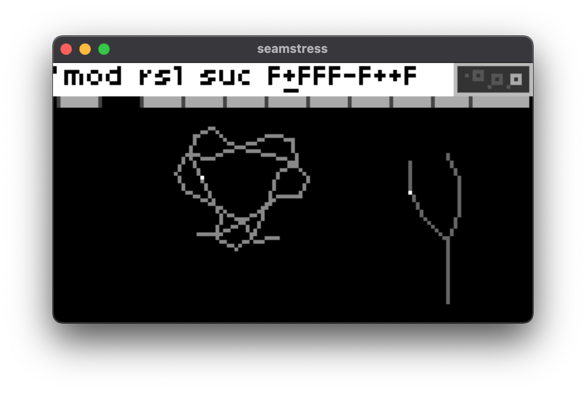

# Flora for Seamstress

An L-systems sequencer originally written for [monome norns](http://monome.org/norns) and adapted for [seamstress](https://github.com/ryleelyman/seamstress)

## Overview

A full explanation of the flora script may be found on the repository page for the [norns version](https://github.com/jaseknighter/flora#readme).

Aside from the user interface, the main difference between the seamstress and norns versions is that flora for seamstress only sequences midi.

## UI

Flora for seamstress more or less folows the norns UI language for navigation. norns encoders and keys are translated into keyboard presses and combinations. 


### Keyboard commands
Basic keyboard presses and combinations are as follows:

* e1: press and release control key + right or left arrow key
* e2: press and release option key + right or left arrow key
* e3: press and release command key + right or left arrow key
* E1: control key held down + right or left arrow key
* E2: option key held down + right or left arrow key
* E3: command key held down + right or left arrow key
* k1: press and release control + shift + right or left arrow key
* k2: press and release option + shift + right or left arrow key
* k3: press and release command + shift + right or left arrow key


### Onscreen instructions
Instructions for each screen can be accessed by pressing `E1+E2 + right or left arrow keys`

### Screens

Flora's interface consists of six screens (or "pages"). Navigation between screens with e1 (activated by pressing and releasing the control key). 

#### Plant 

```
e1: next page  
E2: select active plant
e2: change plant
e3: -/+ angle
k2/k3: prev/next generation
```

#### Modify 

```
e1: next/previous page  
E2: select active plant
e2: select control
e3: select character
E3: change letter/number value
k2/k3: delete/add letter
```

#### Observe 

```
e1: next/previous page  
E2: select active plant
e2: move up/down
e3: move left/right
k2/k3: zoom out/in
```

#### Plow 

```
e1: next/previous page 
E2: select active envelope
k1 + e1: select active plant  
e2: select envelope control  
e3: change envelope control value  
k2/k3: delete/add envelope control point  
```
note: as in the norns version of flora, the envelopes' curve settings do not have any effect on the midi sequencing. 

#### Water 

```
e1: next/previous page  
e2: select control  
e3: change control value  
```
note: as in the norns version of flora, the `amp` and `cf scalar` controls do not have any effect on the midi sequencing. all other controls on the

#### Tinta and Tinta Envelope

```
e1: previous page  
enter commands with external keyboard
```
The tinta interface provides control for the melody accompanying the plant melodies via external keyboard or the Maiden REPL and was inspired by Aarvo Pärt's method of [Tintinnabuli](https://en.wikipedia.org/wiki/Tintinnabuli)).

Tinta makes extensive use of [sequins](https://monome.org/docs/norns/reference/lib/sequins).


<!-- 
as of flora v2.1, three options have been added to set the envelope used by tinta, using the new `tinta env type` parameter in the `tinta` section of flora's parameters menu:

* `ad`: a kind of attack-decay envelope, using the value of tinta's `vel` parameter for envelope level and the active plant for the envelope's other values (`time` and `curve`)
* `plant`: uses the active plant's envelope (set on the `plow` screen)
* `morphing`: the shape of tinta's envelope is morphed between the two plant envelopes (set on the `plow` screen). 

for the `morphing` envelope type, the duration and number of steps, and "shape" of the morph may be set with two new tinta commands: `edu` and `est`. 

there are three "styles" of envelope morphing, set with the new `tinta env morph style` parameter:

* `shuttle`: once a morph is completed, a new morph begins going in the opposition direction
* `loop`: once a morph is completed, a new morph begins, starting with plant 1's envelope shape
* `1-shot`: once a morph is completed, morphing stops (it can be started again by setting the `tinta env morph` parameter to `true`)
 -->
Keyboard commands

| Command                | Description                                       | 
| ---------------------- | ----------------------------------------------------------------- |  
| tin              | set the melody <br> format: `tin=s{1,3,5,s{4,2}}`                      |
| oct              | shift the octave <br>recommended range: +/- 2 <br> format: `oct=s{0,1}`|
| vel              | set the velocity of each note <br>recommended range: 0 - 10 <br> format: `vel=s{0,5}` |
| rhy              | set the rhythm of each note <br>recommended range: 0.1 - 2 <br> format: `rhy=s{1,0.25}`  |
| stop             | stop the melody <br> format: `stop`                                      |
| play             | play the melody <br> format: `play`                                      |
| offdance             | don't adjust melody relative to plant melody  <br> format: `offdance`                                      |
| ondance             | adjust melody relative to plant melody <br> format: `ondance`                                      |
| estart             | start envelope morphing <br> format: `estart`                                      |
| estop             | stop envelope morphing <br> format: `estop`                                      |
<!-- | edu              | set the recommendation morphing duration (in beats) <br>recommended range: 0.125 - 50 <br> format: `edu=s{1,10}`  |
| est              | set the number of steps to complete the morph (each step generates an envelope) <br>recommended range: 1 - 50 <br> format: `est=s{3,20}`  | -->

Important note: when setting the rhythm (`rhy`), nested sequins will throw an error (e.g. `rhy=s{1,s{0.5,0.25}}`).

<!-- REPL commands (using the Maiden REPL)

Using the maiden REPL to control the tinta interface, more [complex sequins](https://monome.org/docs/norns/reference/lib/sequins) functionality can be utilized such as flow-modifiers.

| Tinta Command                | Description                                       | 
| ---------------------- | ----------------------------------------------------------------- |  
| tin              | set the melody <br> format: `tt.tin=s{1,3,5,s{4,2}}`                      |
| oct              | shift the octave <br>recommended range: +/- 2 <br> format: `tt.oct=s{0,1}`|
| vel              | set the velocity of each note <br>recommended range: 0 - 10 <br> format: `tt.vel=s{0,5}` |
| rhy              | set the rhythm of each note <br>recommended range: 0.1 - 2 <br> format: `tt.set_rhythm({1,0.25})`. (note that when setting the rhythm with the maiden repl, a table is passed to the method `tt.set_rhythm` instead of setting the rhythm directly with sequins.)  | -->
<!-- | edu              | set the envelope morphing duration (in beats) <br>recommended range: 0.25 - 50 <br> format: `tt.edu=s{1,10}`  |
| est              | set the number of steps to complete the morph (each step generates an envelope) <br>recommended range: 1 - 25 <br> format: `tt.est=s{3,20}`  | -->


Tinta params menu
| Paramter               | Description                                       | 
| ---------------------- | ----------------------------------------------------------------- |  
| tinta enabled            | turns the tinta melody generator on and off                       |
| dancing notes          | if set to `on` the tinta melody is set relative to the notes played by the plant forms |
| tinta target            | sets which plant to determine the tinta melody when the dancing notes parameter is set to "on"                       |
| tinta method              | sets how the tinta note is selected: `cycle`, `closest`, and `furthest` |
<!-- | tinta env type              | selects the type of envelope used by tinta: `ad`,`plant`,`morph` |
| tinta env morph            | starts and stops morphing when the `tinta env type` parameter is set to `morph`|
| tinta env morph style      | determins how morphing occurs: `shuttle`, `loop`,`1-shot`  | -->

## Requirements
* [seamstress](https://github.com/ryleelyman/seamstress)
* Midi 

## Credits 
* Sososo many thanks are due to @ryleelyman for creating seamstress and providing so much assistance while porting the script.


